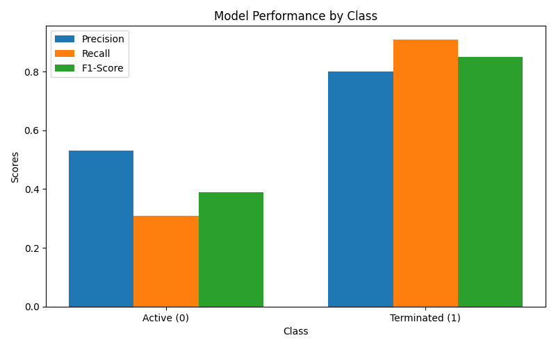
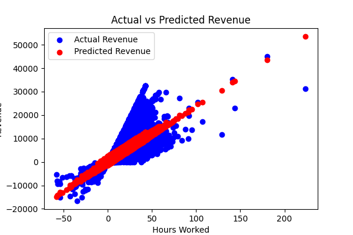
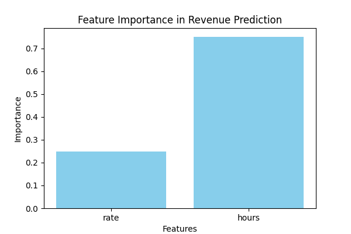

# DSMLC Project - Final Competition 25' [NOT FINAL for now]
These are the projects related to the DSMLC Final Competition 2025

### 1-Active Terminated Model
- This is a simple Logical Regression Model created to find out the performance of employees at a scale
- This is done using takind in their Target ratio and hiredate
- The threshold set in this is 0, but can be changed to a certain specific value to change the True/False Relationship

### 2-Simple Linear Regression Model
- This is a model that works on a variable 'Revenue' and predicts the future potential imcome for the company using a Linear Regression Model

### 3-Forest Regression Model
- This is implementing a Random Forest Regression, where the model predicts the the revenue generated by employees and should be a better benchmark for predicting the values

